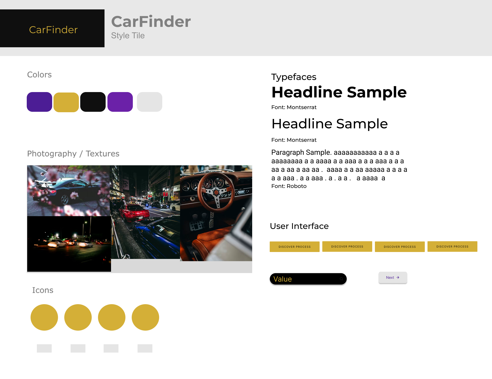

# Project Proposal
# CarFinder

## Application Definition Statement

*A clear high-level summary should be used to introduce the concept. This should be similar to an elevator pitch or a conversational reply to "What are you building?”. You will explore the audience and their demographics, the problem they are having, and your solution in subsequent sections in more detail but touch on them here.* 

*Clarity over quantity should be the focus, to that end, creating visuals/charts to explain the more complex data or logical points could help to reinforce your Application’s Definition Statement.*

I am building a web application that helps users search for and explore cars based on different criteria such as year, make, and model. The goal of the application is to provide a simple and interactive way for users to filter car data and quickly find the information they are looking for. This project will allow me to practice building a full web application that includes a front end interface, backend API, and database while also creating something that can be added to my development portfolio.

## Target Market

*Using Primary and Secondary research, describe the people most likely to be utilizing your application. What are their ages, education level, employment sector, income level, hobbies, or any other defining characteristics that set them apart from other groups of people? Identifying specific groups will help drive application design choices.*

*Primary Research is research that you have conducted yourself and is not based on secondary sources. Examples of Primary Research include surveys, interviews, and focus groups. This doesn't have to be formal in nature and can include discussions you have with individuals that are likely users of your application. Secondary Research is research that has been conducted by others and is based on their findings. Examples of Secondary Research include market research reports, industry publications, and news articles.*

The target market for this application includes people who are interested in researching vehicles, such as potential car buyers, car enthusiasts, and individuals comparing different car models. Most users would likely be between the ages of 18–45 and comfortable using web applications to search for information online.

Primary research for this project comes from general discussions with friends and coworkers who often search online for information about vehicles before purchasing one. Secondary research also shows that many people use online tools and websites to compare vehicle specifications, prices, and features before making a purchase decision. Websites like Kelley Blue Book and Carfax demonstrate that there is strong demand for simple online tools that allow users to search and filter car information.

## User Profile / Persona

*User profiles are a snapshot of an actual person and helps to open a window into the mind of an actual user and will provide insight while tailoring and refining interaction details to best fit your ideal users within your Target Market.*

Name: Alex

Age: 28

Occupation: Sales Associate

Alex is interested in buying a used car but wants to compare different models before making a decision. Alex often searches online for vehicle information such as make, model, and year to understand what options are available. Alex prefers websites that are simple to use and allow filtering options so results can be narrowed down quickly.

## Use Cases

*A 'Use Case' describes how a user may interact with your application. It provides a series of steps to reach a desired result. If a user wants to listen to some music during a workout, how many clicks would it take to do that? Begin with a simple question like that and then map out the different steps to reach the desired goal. Use cases help us think through how our application will be used.*

*Use Cases help drive design decisions as well as testing procedures. During development we regularly test and confirm the work in progress matches up with our Use Cases. This provides valuable insight into how our application is addressing the needs of the user and allows us to correct missteps early. This [article](https://www.softwaretestinghelp.com/use-case-testing/) gives additional background Use Cases and Use Case Testing.*

Use Case 1 – Searching for a Car

- User opens the application in their browser

- User selects a car year from the dropdown menu

- User selects a make and model

- The application displays matching car results

Use Case 2 – Filtering Car Data

- User visits the application homepage

- User chooses filtering options such as year or brand

- The system updates the results dynamically

- The user reviews the filtered car information

## Problem Statement

*In a few sentences explain the problem your target market is seeing that requires this project to be built. This will identify why is your application needed and needs to be supported by Primary Research.*

Many people searching for vehicle information online must navigate multiple websites or deal with overly complex interfaces. This can make it difficult to quickly compare vehicles or find specific information. A simpler web application that allows users to filter car data by specific attributes can make the search process faster and easier.

## Pain Points

*Explain your audience’s pain points that are contributing to their defined problem and their impact on the user. Primary Research should support your explanations.*

Users often experience frustration when searching for car information online because many websites contain too many advertisements, unnecessary features, or complicated interfaces. Another common pain point is that many sites require multiple pages or steps to compare vehicles. These issues make the research process slower and less user-friendly.

## Solution Statement

*How is your project going to solve the problem outlined above? Consider the competing products in your market space. What makes your solution different from other’s attempts to solve the problem? How are you able to better solve the defined problem for your audience than your competition?*

This application will provide a simple interface where users can quickly search and filter vehicles using dropdown selections and dynamic results. By focusing on usability and simplicity, the application will make it easier for users to locate vehicle information without navigating multiple complex websites.

## Competition

*What competing products exist to solve this or a similar problem? Identify and summarize competing products and how their approach to solving your identified problem differ from your own.*

Several websites already provide vehicle information such as Kelley Blue Book, Carfax, and Edmunds. These sites offer detailed car data but often include many additional features such as financing tools, advertisements, and dealership listings. My application focuses on a simpler experience that allows users to quickly search and filter car data without unnecessary complexity.

## Features & Functionality

*Define key features and functionality intended to provide solutions to specific problems and pain points you have identified. These key items should be specifically defined in response to problems / pain points.*

*A good way to identify a Key Feature is to use the phrase 'In order to [solve this problem] I need to [do this]'. For example, 'In order to listen to music while I workout I need to be able to create a playlist'.*

*Features and functionality should be prioritized based on their importance to the user. This will help you focus on the most important features first and then add additional features as time allows.*

Search Filtering
The user will be able to filter cars by year, make, and model. This allows users to quickly narrow down results and find specific vehicles.

Dynamic Results Display
The application will display results automatically after a user selects filtering options. This improves usability and reduces the need for page reloads.

User Friendly Interface
The application will focus on a simple and clean design that allows users to easily navigate and interact with the system.

## Integrations

*Use of an API is expected. This can be 3rd party APIs, your own API, or a combination of data sets. Identify which integrations are planned for and outline how you will use them transformatively. For 3rd party APIs provide links to their respective documentation and verify that your intended use complies with their Terms of Service.*

The CarFinder application will use external APIs to retrieve vehicle data and display it dynamically based on user selections.

One API being considered is the NHTSA Vehicle API. This API provides detailed information about vehicles, including make, model, and year data. It will be used to populate dropdown menus and return accurate vehicle information based on user input.

Another API being explored is the CarQuery API, which allows filtering of vehicles by year, make, and model. This fits directly with the main functionality of the application and will be used to return filtered results based on user selections.

Additional research is being done to compare API reliability, data structure, and ease of integration before finalizing the implementation.

## Style Tile

Below is the style tile used for the branding, colors, typography, and direction for the CarFinder application.

